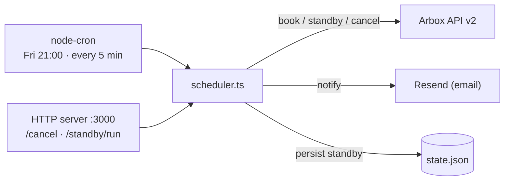

<div align="center">

# 📅 arbox-schedule

**Hands-free class booking for [Arbox](https://www.arboxapp.com/) gyms** — _book · standby · confirm · notify_

[](#license)


A small TypeScript bot that books your preferred Arbox classes the moment registration opens, joins
the standby list when a class is full, and auto-confirms standby slots before they expire — emailing
you at every step. Runs as a long-lived scheduler with two cron jobs and a tiny HTTP server for
one-click cancellations.

</div>

> ⚠️ **Unofficial — uses a reverse-engineered Arbox API.** This talks to the private Arbox v2 API
> (`apiappv2.arboxapp.com`) with your own credentials. It is a personal-use automation, not an Arbox
> product; the API can change without notice. Use at your own risk.

---

- **Explore** — [What it is](#what-it-is) · [How it works](#how-it-works) · [Quick start](#quick-start) · [Architecture](#architecture) · [Tech stack](#tech-stack) · [Configuration](#configuration) · [Testing](#testing) · [Deployment](#deployment) · [Docs & decisions](#docs--decisions)

---

## What it is

Arbox opens bookings for the following week every Friday evening. `arbox-schedule` automates that
race so you don't have to sit at your phone:

- **Friday 21:00 (Israel time)** — the booking job fetches next week's schedule, finds your preferred
  classes by series ID (in priority order), and books up to **2 lessons**. If a class is already
  full, it joins the standby list and persists the entry to local state.
- **Every 5 minutes** — the standby job polls open standby entries. When Arbox frees a slot (by
  setting an `availability_id`), the bot immediately confirms the booking and emails you. Expired
  entries are cleaned up.
- **Email at every step** via [Resend](https://resend.com) — a summary after each booking run, and
  individual alerts when a standby spot is confirmed, lost, or expires.
- **One-click cancel links** — booking emails include an HMAC-signed `/cancel` URL so you can drop a
  reserved class straight from your inbox.

## How it works

### The booking job (Friday)

Targets next week (Sunday–Saturday) and walks your series IDs in priority order — primary list first,
then secondary — booking up to **2 lessons** per week. For each candidate:

| Class state | Action |
|---|---|
| Already booked / on standby | Counts as a slot, skips |
| Spot available (`free > 0`) | Books immediately |
| Class full (`free == 0`) | Joins standby, records the entry in `state.json` |

> **Note on `has_spots`:** the Arbox API exposes a `has_spots` field, but it reflects *membership
> eligibility*, not raw availability. The bot uses `free > 0` instead. See [`docs/api.md`](docs/api.md).

### Standby confirmation

When a booked user cancels, Arbox promotes the first person on standby by setting `availability_id`
on the schedule item and sending a notification — the user then has **~30 minutes** to confirm. The
standby job polls every 5 minutes; when it sees a non-null `availability_id` for a tracked entry it
calls `scheduleUser/insert` with that ID to confirm. If the ID has already expired, the error is
logged and the entry is retried next cycle.

### Cancellation links & manual triggers

The scheduler also runs a tiny HTTP server (default port `3000`) exposing:

| Endpoint | Purpose |
|---|---|
| `GET /cancel?token=…` | Cancels a booking from a signed link embedded in booking emails (HMAC-SHA256, ~8-day TTL) |
| `POST /standby/run` | Fires the standby job on demand (`202 started`, or `409 already-running`) |

Cancellation links are only generated when `CANCEL_SECRET` and `BASE_URL` are set.

## Quick start

Requires **Node 22+** (or Docker). Install, configure, then run the scheduler:

```bash
npm install
cp .env.example .env   # then fill in the values below
npm start              # ts-node schedule/scheduler.ts — runs until killed
```

On start it logs the registered jobs and endpoints:

```
Booking job:  every Friday at 21:00 Israel time (0 21 * * 5)
Standby job:  every 5 minutes (*/5 * * * *)
Endpoints:    POST /standby/run, GET /cancel?token=...
HTTP server:  listening on port 3000
```

**Discover your IDs** — if you don't know your `BOX_ID`, `LOCATION_ID`, or `MEMBERSHIP_ID`, set just
your credentials and run the helper:

```bash
npx ts-node scripts/discover-ids.ts   # prints all three
```

**Find series IDs** — each recurring class belongs to a stable series (e.g. "HIIT, Sunday, 08:10").
Dump next week's schedule with each class's `series_fk`:

```bash
npx ts-node scripts/debug-schedule.ts
```

**Trigger a booking run immediately** (useful for testing):

```bash
npx ts-node scripts/trigger-booking.ts
```

## Architecture

A single long-lived Node process registers two cron jobs and an HTTP server. All state is a single
JSON file; the only outbound dependencies are the Arbox API and Resend.



```
schedule/
  scheduler.ts   # entry point — registers both cron jobs + HTTP server
  booking.ts     # Friday booking logic
  standby.ts     # standby polling and auto-confirmation
  cancel.ts      # HTTP server: signed /cancel links + /standby/run
  state.ts       # JSON-based state persistence (standby list)
  config.ts      # loads and validates env vars
  notify.ts      # email notifications via Resend
  utils.ts       # date helpers
api/
  client.ts      # Arbox HTTP client (reverse-engineered v2 API)
  requests/      # auth · user · boxes · schedule calls
  types/         # response shapes
scripts/
  discover-ids.ts    # one-off: prints BOX_ID, LOCATION_ID, MEMBERSHIP_ID
  trigger-booking.ts # manually trigger the booking job
  debug-schedule.ts  # dump next-week schedule + test a booking attempt
docs/
  api.md             # reverse-engineered Arbox API v2 reference
```

State is written to `state.json` in the working directory (overridable via `STATE_FILE`). It tracks
which classes you are on standby for — the only persistent runtime artifact.

## Tech stack

| Layer | Tech |
|---|---|
| Runtime | Node 22, TypeScript 5 (run via `ts-node`) |
| Scheduling | [node-cron](https://www.npmjs.com/package/node-cron) (`Asia/Jerusalem` timezone) |
| HTTP server | Node `http` (no framework) |
| Email | [Resend](https://resend.com) |
| Config | `dotenv` |
| Tests | [Vitest](https://vitest.dev) |
| Lint / format | ESLint + Prettier (Husky pre-commit) |
| Packaging | Docker (`node:22-alpine`) |

## Configuration

Copy `.env.example` to `.env` and fill in the values:

| Variable | Description |
|---|---|
| `ARBOX_EMAIL` | Your Arbox login email |
| `ARBOX_PASSWORD` | Your Arbox password |
| `BOX_ID` | Numeric ID of your gym (box) |
| `LOCATION_ID` | Numeric ID of the gym location (`locations_box` ID) |
| `MEMBERSHIP_ID` | Your active membership record ID (required to book) |
| `PRIMARY_SERIES_IDS` | Comma-separated series IDs — booked first, in order (e.g. `76644881,76647404`) |
| `SECONDARY_SERIES_IDS` | Comma-separated fallback series IDs — used if primary slots are full |
| `RESEND_API_KEY` | API key from [resend.com](https://resend.com) |
| `NOTIFICATION_EMAIL` | Address that receives booking notifications |
| `CANCEL_SECRET` | _(optional)_ HMAC secret for signed `/cancel` links |
| `BASE_URL` | _(optional)_ Public base URL used to build `/cancel` links |
| `PORT` | _(optional)_ HTTP server port (default `3000`) |
| `STATE_FILE` | _(optional)_ Path to the state JSON file (default `./state.json`) |

During development, Resend sends from `onboarding@resend.dev`, which only delivers to your
Resend-verified address. Once you have a verified sending domain, update the `from` field in
[`schedule/notify.ts`](schedule/notify.ts).

**Email notifications:**

| Event | Subject |
|---|---|
| Friday booking run complete | `Arbox booking — N of 2 lessons scheduled` |
| Standby spot confirmed | `✅ Standby confirmed` |
| Standby position lost | `❌ Standby slot lost` |
| Standby entry expired (past) | `ℹ️ Standby expired` |

## Testing

```bash
npm run typecheck   # tsc --noEmit
npm run lint        # ESLint
npm run format      # Prettier (write)
npm test            # Vitest unit tests
```

Tests live in [`tests/`](tests/) and cover booking, standby, cancellation, and the HTTP server
against mocked Arbox API responses.

## Deployment

The repo ships a `Dockerfile` ready for [Coolify](https://coolify.io/) or any Docker-compatible host:

```bash
docker build -t arbox-schedule .
docker run -d \
  --env-file .env \
  -v $(pwd)/state.json:/app/state.json \
  arbox-schedule
```

The container runs `ts-node schedule/scheduler.ts` on startup. Mount a persistent volume at the
`STATE_FILE` path (default `/app/state.json`) so standby state survives restarts. On Coolify: push the
repo, let it detect the `Dockerfile`, set the env vars, and mount the state volume.

## Docs & decisions

- **Arbox API v2 reference:** [`docs/api.md`](docs/api.md) — auth flow, request/response shapes, error
  codes, and non-obvious behavior (the `has_spots` vs `free` distinction, the standby confirmation flow).
- **Design spec:** [`docs/superpowers/specs/2026-04-25-lesson-scheduler-design.md`](docs/superpowers/specs/2026-04-25-lesson-scheduler-design.md)
- **Implementation plan:** [`docs/superpowers/plans/2026-04-25-lesson-scheduler.md`](docs/superpowers/plans/2026-04-25-lesson-scheduler.md)

## License

No license file is currently present in this repository — all rights reserved by default. Add a
`LICENSE` to clarify reuse terms.
