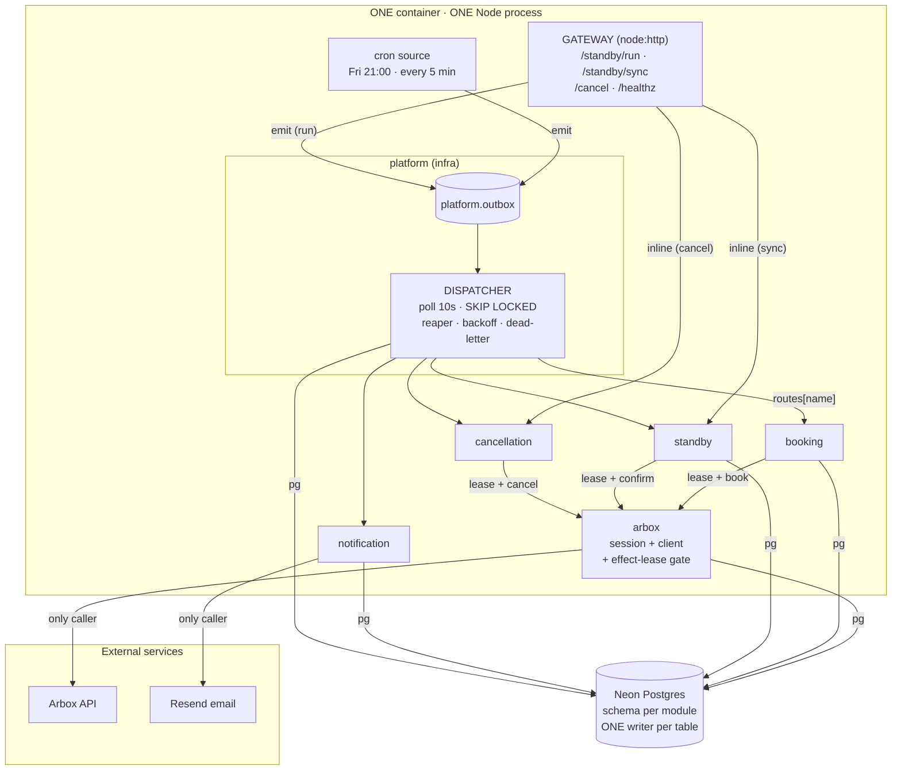
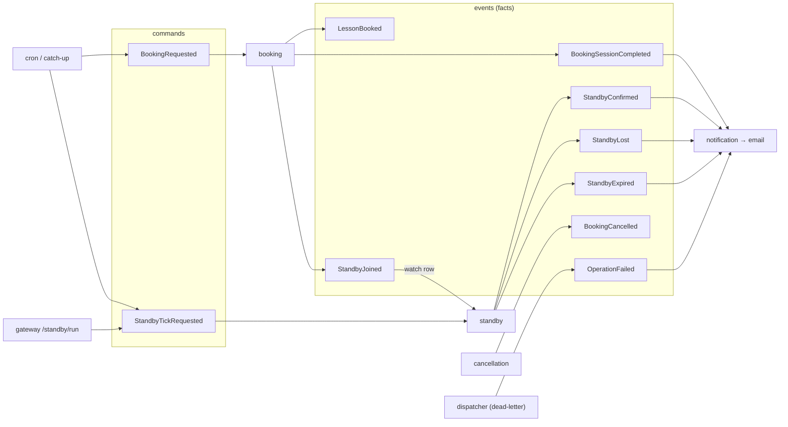
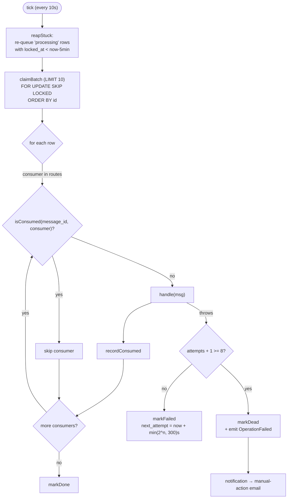
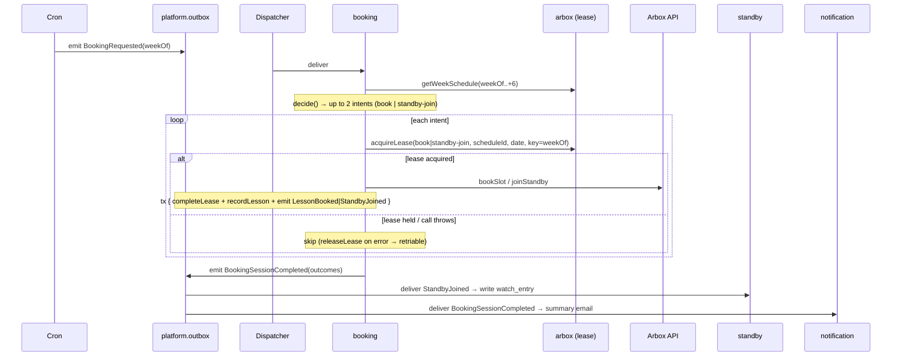
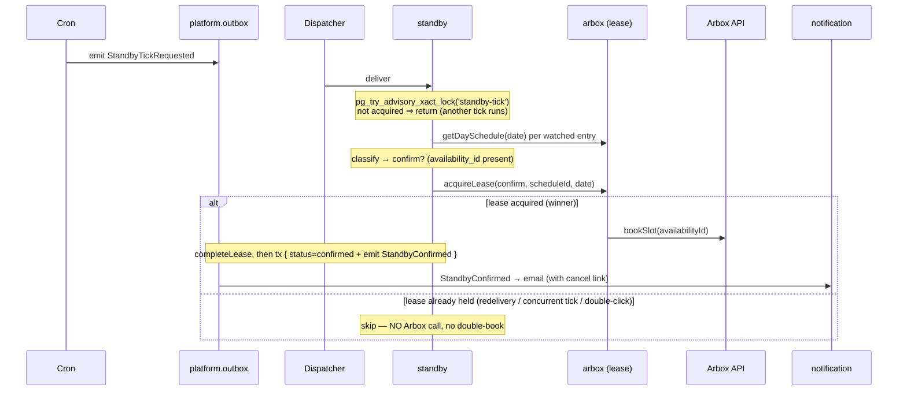
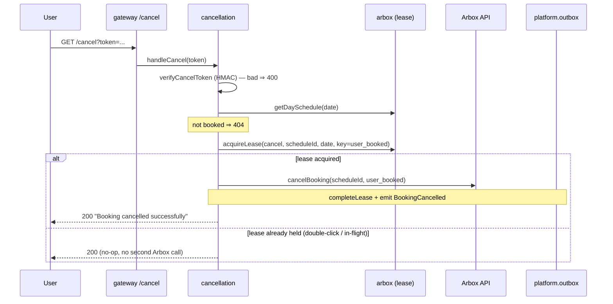

# Architecture & flows

`arbox-schedule` is an **event-driven modular monolith**: one Node process, one container, one
Neon Postgres database. A **gateway** is the sole HTTP ingress; **cron** is the sole scheduled
trigger; both only ever _emit_ a message onto a Postgres **transactional outbox**. A single
**dispatcher** polls that outbox and fans each message out to domain modules. Modules never call
each other and never write each other's tables — they coordinate exclusively through events.

Three invariants carry the design; every diagram below illustrates at least one:

- **Single writer per table** — each table has exactly one module allowed to write it. Cross-module
  change happens by emitting an event, never by a shared write.
- **Effect-lease before every Arbox side-effect** — the Arbox booking API is _non-idempotent_ and
  returns `200` even on no-ops, so a committed lease row (`arbox.effect_ledger`) is acquired
  **before** any `bookSlot`/`cancelBooking`. Lose the lease race ⇒ skip entirely, no Arbox call.
- **Ordering: lease (committed) → Arbox call (no tx) → result tx (state change + emit)** — the
  network call sits between two commits so a crash never both books _and_ forgets, or forgets _and_
  books.

---

## 1. System architecture (container view)

> Boot order (`src/main.ts`): `loadConfig → createPool → runMigrations → runStartupCatchup →
dispatcher.start → startCron → startServer`. The `arbox` module is the **only** caller of the
> Arbox API; `notification` is the **only** caller of Resend. Cancel and sync run **inline** (a
> human blocks on the HTTP response); all cron work is async and durable via the outbox.

---

## 2. Single-writer-per-table matrix

Exactly one module may write each table. This is the structural enforcement of module isolation —
violating it is a design bug, not a style preference.

| Schema         | Table               | Sole writer                                     | Purpose                                   |
| -------------- | ------------------- | ----------------------------------------------- | ----------------------------------------- |
| `platform`     | `outbox`            | `emit()` appends · **dispatcher** delivery cols | durable command/event queue               |
| `platform`     | `consumed`          | dispatcher                                      | `(message_id, consumer)` processed-once   |
| `platform`     | `schema_migrations` | `migrate.ts`                                    | applied migrations                        |
| `arbox`        | `effect_ledger`     | **arbox**                                       | the idempotency gate (effect-lease)       |
| `booking`      | `booking_run`       | **booking**                                     | one row per Friday run (`week_of` UNIQUE) |
| `booking`      | `booked_lesson`     | **booking**                                     | per-slot audit                            |
| `standby`      | `watch_entry`       | **standby**                                     | durable watchlist (replaces state.json)   |
| `notification` | `sent_email`        | **notification**                                | email dedupe by `dedupe_key`              |

> The outbox is not an exception to the rule: domain modules only _append_ via `emit(tx, msg)`; the
> single dispatcher owns the delivery columns (`status`, `attempts`, `locked_at`, …). When booking
> joins a waitlist it emits `StandbyJoined`; **standby** — not booking — writes the `watch_entry`.

---

## 3. Event catalog

Commands (directed, one consumer) and events (facts, 0..N consumers) ride the same outbox,
discriminated by `kind`. Adding a consumer is one push into `routes[name]`.

> `OperationFailed` is emitted by the dispatcher when a message exhausts its retries — it turns a
> silent dead-letter into a manual-action email instead of a swallowed `console.error`.

---

## 4. Dispatcher / outbox lifecycle (one tick, every 10s)

> `consumed` is a delivery-dedup _optimization_; the real guard against a re-run causing a
> double-effect is the per-module idempotency (the effect-lease for Arbox calls, `sent_email` for
> emails). Poll-only (no `LISTEN/NOTIFY`) is deliberate: Neon's PgBouncer transaction pooling can't
> hold a session listener, and one user doesn't need sub-second latency.

---

## 5. Friday booking flow

Fires at **Fri 21:00 Asia/Jerusalem** (or on startup catch-up if a redeploy crossed that window).
Walks PRIMARY → SECONDARY series, stops at 2 lessons; each slot is independently lease-gated.

> `booking_run.week_of` is UNIQUE and `attempt_key = weekOf`, so a duplicated `BookingRequested`
> (cron + catch-up racing) re-acquires nothing and books nothing twice.

---

## 6. Standby confirm flow — the money path

Every 5 minutes the tick checks each watched entry; when Arbox frees a slot it auto-confirms. This
is where a double-confirm would actually cost money, so it is the most heavily guarded path.

> Two layers serialize this: the **advisory lock** stops two overlapping ticks from both scanning,
> and the **effect-lease** stops any second path (redelivery, manual `/standby/run`) from issuing a
> second `bookSlot`. `lost`/`expired` decisions emit their own events and never touch the lease.

---

## 7. One-click cancel flow

The booking confirmation email carries an HMAC-signed `GET /cancel` link. It runs **inline** —
the clicking human blocks on the response — and is lease-gated so a double-click is a no-op `200`.

> `attempt_key = user_booked` (the booking instance id) means a double-click on the same link is an
> idempotent no-op, yet a later _re-book_ of the same slot gets a fresh booking instance and can be
> cancelled again.
